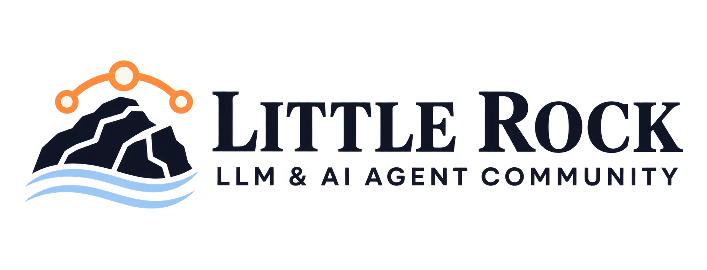

# Little Rock LLM & AI Agent Community

A local community for people exploring large language models, AI agents, and the systems being built around them.

We bring together developers, founders, researchers, students, professionals, and curious newcomers across Little Rock and Central Arkansas.

No advanced AI background is required. Curiosity is enough.

## What We Do

We meet to:

- Explain AI concepts in clear, practical language
- Build and test real AI applications
- Explore how large language models and AI agents work
- Discuss new models, tools, research, and industry developments
- Connect people working with or learning about AI in Arkansas

Our sessions combine accessible explanations, live demonstrations, hands-on activities, and open discussion.

## Our Learning Series

Our community sessions are organized into focused learning series. Each series approaches AI from a different direction, moving between practical building and deeper technical understanding.

### Series 01: Build with AI

Our first series followed the journey of building an AI application from an initial idea to a working product.

Members explored product design, application architecture, data modeling, authentication, AI search, categorization, deployment, and presentation.

The series included:

1. **LLM and AI Agent Community**  
   Community introduction and kickoff

2. **From Idea to Agentic App**  
   Turning a problem into an AI product concept

3. **Notes App: From Data Model to Deploy**  
   Designing the data layer and deploying a working application

4. **AI Search, Authentication, and Product Polish**  
   Adding intelligence, user access, and a stronger product experience

5. **Expense Tracker with Smart Categorization**  
   Using AI to classify and organize real-world information

6. **Ship Day Demo Showcase**  
   Presenting completed projects and lessons learned

7. **Wrap and Connect**  
   Reflecting on the series and strengthening community connections

The goal was simple: move beyond talking about AI and build something with it.

### Series 02: Behind the Scenes

Our second series examines what happens beneath the surface of modern AI systems.

Instead of focusing only on what AI can produce, we explore the mechanisms that make those results possible.

Topics include:

- How text becomes tokens
- How language models generate responses
- How context windows and memory work
- How models use tools
- How AI agents plan and take action
- How to evaluate reliability and safety
- How different parts of an AI system work together

Each session focuses on one important concept and makes it understandable through examples, demonstrations, and experimentation.

## Who Is This Community For?

You will feel at home here if you are:

- Learning about AI for the first time
- Building applications with language models
- Exploring AI agents and automation
- Applying AI within your profession or organization
- Researching the technical or social impact of AI
- Looking for local collaborators
- Simply curious about what is happening

You do not need to be a programmer to participate.

## Community Principles

### Learn in public

Questions, experiments, and unfinished ideas are welcome.

### Build with purpose

We focus on practical applications that solve real problems.

### Understand what we use

We want members to understand the systems behind the tools, not only how to operate them.

### Share what you discover

Community knowledge grows when people explain what worked, what failed, and what they learned.

### Keep the room welcoming

We respect different backgrounds, skill levels, disciplines, and perspectives.

### Use AI responsibly

We take privacy, safety, transparency, and human impact seriously.

## Projects and Resources

This organization will host:

- Community project repositories
- Code from the Build with AI series
- Examples from Behind the Scenes sessions
- Workshop materials
- Learning resources
- Starter templates
- Experiments contributed by members

Repositories will be added as community projects and sessions develop.

## Get Involved

You can participate by:

- Attending a community session
- Joining a discussion
- Suggesting a future topic
- Contributing to a community project
- Sharing a useful resource
- Helping another member learn
- Presenting something you have built

Watch this organization and its repositories to follow new projects and resources.

## Contributing

Contributions are welcome.

Before contributing to a repository, review its README and contribution guidelines. If you are unsure where to begin, open a discussion or look for issues labeled `good first issue`.

## Connect With the Community

- **Location:** Little Rock, Arkansas
- **Events:** [Learn more on MeetUMO](https://meetumo.ai/c/llm-and-ai-agent-community)

---

**Connect. Learn. Build. Grow.**
